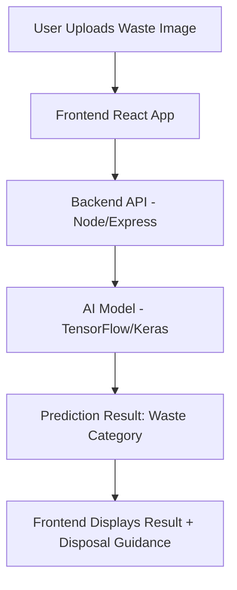

---

# 🌱 GreenBin – Smart Waste Sorting Assistant


## 📌 Overview

GreenBin is a **smart waste sorting assistant** that uses **AI and Machine Learning** to classify waste images into categories like *recyclable, organic, hazardous, and others*. It provides disposal guidance to help households, communities, and municipalities manage waste more efficiently.

This project is designed to **reduce landfill waste**, **encourage recycling**, and promote **sustainable waste management practices**.

---

## 🚀 Features

✅ Upload an image of waste and get classification in real time
✅ AI-powered classification using a trained CNN model
✅ User-friendly **web interface** with modern UI/UX
✅ Disposal guidance for each category
✅ Scalable system – can be integrated with **IoT smart bins** in the future

---

## 🏗️ Tech Stack

### **Frontend**

* React.js
* Next.js
* Tailwind CSS
* ShadCN/UI
* Framer Motion (animations)
* Lucide Icons

### **Backend**

* Node.js
* Express.js

### **AI/ML**

* TensorFlow / Keras (CNN-based image classifier)
* Preprocessed waste dataset

### **Deployment & Tools**

* Vercel / Netlify (Frontend)
* Node.js server (Backend)
* GitHub for version control
* Docker (optional, for containerization)

---

## 🔄 Data Flow



---

## 🛠️ Installation & Setup

### 1️⃣ Clone the Repository

```bash
git clone https://github.com/your-username/GreenBin-Smart-Waste-Sorting-Assistant.git
cd GreenBin-Smart-Waste-Sorting-Assistant
```

### 2️⃣ Install Dependencies

#### Frontend

```bash
cd frontend
npm install
```

#### Backend

```bash
cd backend
npm install
```

### 3️⃣ Run the Project

#### Start Backend

```bash
cd backend
npm start
```

#### Start Frontend

```bash
cd frontend
npm run dev
```

### 4️⃣ Access

Open in browser → `http://localhost:3000`

---

## 📊 Dataset

* Waste classification dataset (collected from **open-source datasets**).
* Categories: *Recyclable, Organic, Hazardous, General Waste*.
* Preprocessed & augmented to improve model accuracy.

---

## 🌟 Unique Selling Proposition (USP)

* Real-time, accurate AI-based waste classification.
* Scalable for **community & municipal-level adoption**.
* Can integrate with **IoT-enabled smart bins**.
* Clean & modern UI → better user adoption.

---

## 🔮 Future Enhancements

* Mobile application (Android/iOS).
* Multi-language support.
* Smart-bin IoT integration.
* Cloud-based model hosting for faster inference.
* Predictive analytics for waste management.

---

## ⚠️ Risks, Challenges & Dependencies

* **Challenges:** Model accuracy depends on dataset quality, handling new/unseen waste types.
* **Dependencies:** Stable internet, cloud servers, reliable image dataset.
* **Risks:** Data privacy concerns with uploaded images, scalability for large user base.


---

## 📈 Impact & Benefits

* Encourages **sustainable waste management**.
* Reduces **manual effort** in waste segregation.
* Supports **government/NGO recycling initiatives**.
* Educates users on eco-friendly disposal.

---

## 👨‍💻 Contributors

* **Abhinav Prakash** – Project Lead & Developer
* Team Members - Ritesh Pandey, Amitesh Ranjan


